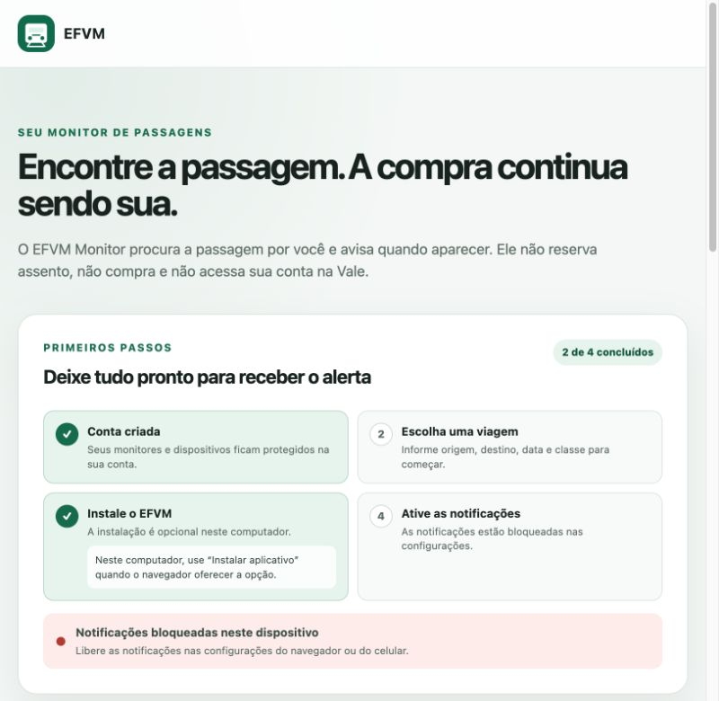
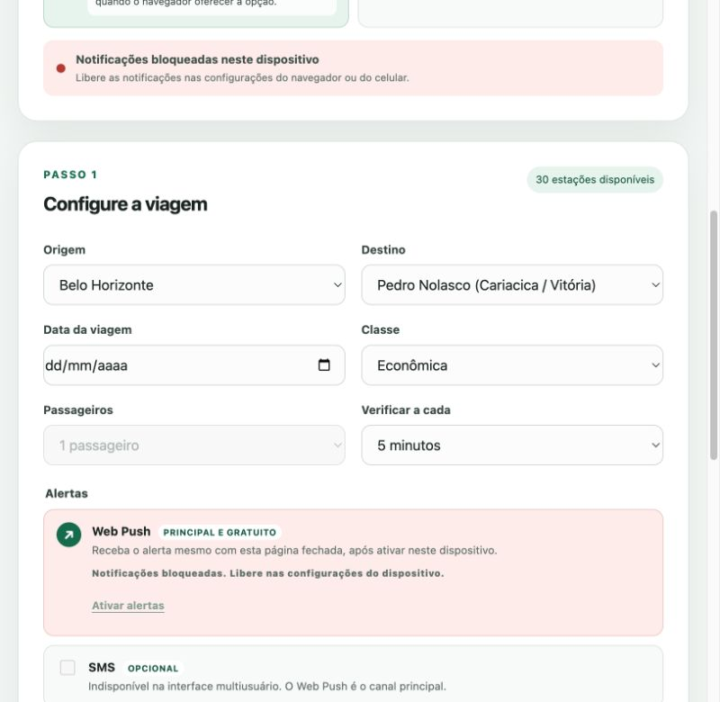

# EFVM Monitor

[](https://github.com/rhaynermartins/EFVM-Monitor-/actions/workflows/ci.yml)
[](https://www.python.org/)
[](LICENSE)

Monitor independente de disponibilidade de passagens do Trem de Passageiros da Estrada de
Ferro Vitória a Minas (EFVM). A aplicação procura a viagem configurada e avisa quando encontra
vaga; a compra continua sendo feita manualmente no portal oficial.

**O EFVM Monitor não é afiliado à Vale. Não compra, reserva ou bloqueia passagens, não escolhe
assento, não preenche CPF, não acessa contas da Vale e não realiza pagamentos.**

[Abrir instância pública](https://efvm-monitor-rhayner.duckdns.org) ·
[Política de Privacidade](PRIVACY.md) · [Termos de Uso](TERMS.md) ·
[Segurança](SECURITY.md)

## Problema e solução

Em datas concorridas, consultar repetidamente o portal consome tempo e ainda não garante que a
vaga estará disponível no momento da compra. O EFVM Monitor automatiza somente a consulta
prévia e responsável:

1. o usuário escolhe origem, destino, data, classe e intervalo;
2. um worker independente consulta a disponibilidade;
3. o resultado `TEM_VAGA`, `SEM_VAGA` ou `ERRO` é salvo no SQLite;
4. na transição para `TEM_VAGA`, o Web Push alerta os dispositivos vinculados àquela conta;
5. o usuário abre o canal oficial e conclui a compra por conta própria.

Enquanto o estado continuar `TEM_VAGA`, o alerta não é repetido. Depois de
`TEM_VAGA → SEM_VAGA → TEM_VAGA`, uma nova notificação pode ser enviada.

## Visão do produto





As capturas foram produzidas localmente com uma conta sanitizada e não contêm dados da instância
de produção.

## Recursos

- interface responsiva e mobile-first;
- PWA instalável em iPhone, Android e navegadores compatíveis;
- Web Push/VAPID como canal principal, gratuito e isolado por usuário;
- cadastro, login, logout, sessão persistente e proteção CSRF;
- ownership de monitores, histórico e dispositivos validado no backend;
- múltiplos monitoramentos simultâneos com pausa, retomada e remoção lógica;
- retomada automática dos monitores ativos após reinicialização;
- SQLite com migrations incrementais e histórico de verificações;
- healthcheck de servidor, banco, manager e workers;
- logs estruturados, limites defensivos e recuperação de workers;
- SMS/Twilio e WhatsApp Cloud API opcionais para instalações privadas, desativados por padrão;
- CLI para consulta única ou contínua;
- CI com testes, Ruff e validação JavaScript.

## Arquitetura

```text
Navegador / PWA
  ├── sessão segura + CSRF
  ├── dashboard e histórico
  └── Service Worker / Web Push
            │ HTTPS
            ▼
          Caddy
            │ 127.0.0.1:8000
            ▼
FastAPI + um MonitoringManager
  ├── autenticação e isolamento por usuário
  ├── rate limiting em memória
  ├── workers independentes por monitor
  ├── cliente HTTP do portal da Vale
  ├── NotificationService / Web Push
  └── camada de persistência
            │
            ▼
      SQLite persistente
      + backup diário
```

A implantação atual usa exatamente um processo Uvicorn e um `MonitoringManager`. Essa decisão
evita workers duplicados e escrita concorrente entre processos no SQLite, além de permanecer
compatível com a VM Oracle Cloud Always Free de 1 GB.

## Stack

- Python 3.11+, FastAPI e Uvicorn;
- HTTPX para consultas e integrações HTTP;
- Jinja2, HTML, CSS e JavaScript sem framework frontend;
- SQLite e migrations SQL versionadas;
- PyWebPush/VAPID, Service Worker e Push API;
- Caddy para HTTPS e proxy reverso;
- systemd para aplicação e backups;
- Pytest, Ruff e GitHub Actions.

## Consulta legítima ao portal

A [página oficial da Vale](https://www.vale.com/pt/trem-de-passageiros) direciona ao Portal do
Trem de Passageiros. O formulário público consulta interfaces HTTP de leitura antes de qualquer
início de compra; por isso o projeto usa HTTP, e não automação visual. O monitor não usa nem
persiste token de compra retornado pelo portal.

Essas interfaces não são uma API pública documentada e podem mudar sem aviso. Os intervalos
aceitos são 5, 10, 15 e 30 minutos, 1 hora ou 3 horas, validados também no backend.
Se o portal apresentar CAPTCHA, autenticação, bloqueio ou outra proteção, o EFVM Monitor
registra e trata a situação sem tentar contorná-la.

Monitoramentos de viagens passadas são pausados automaticamente na virada do dia seguinte à
viagem, no fuso `America/Sao_Paulo`. A data da viagem permanece válida durante todo o próprio
dia. Viagens expiradas não retomam após reinício; o monitor e seu histórico são preservados,
e somente o usuário decide removê-los pelo fluxo existente.

## Instalação local

Requisitos: Python 3.11 ou superior, acesso à internet e Git.

```bash
git clone https://github.com/rhaynermartins/EFVM-Monitor-.git
cd EFVM-Monitor-
python3 -m venv .venv
source .venv/bin/activate
python -m pip install --upgrade pip
python -m pip install -e '.[dev]'
cp .env.example .env
```

Em desenvolvimento local, mantenha no `.env`:

```dotenv
EFVM_COOKIE_SECURE=false
EFVM_DATABASE_PATH=data/efvm-monitor.db
```

Inicie a aplicação:

```bash
efvm-monitor-web
```

Abra [http://127.0.0.1:8000](http://127.0.0.1:8000), crie uma conta e configure a
viagem. O servidor de desenvolvimento escuta somente em `127.0.0.1`.

## PWA e Web Push

O Web Push usa padrões do navegador e VAPID; não depende de Firebase. Gere o par de chaves uma
única vez:

```bash
efvm-monitor generate-vapid-keys
```

Guarde a chave privada somente no `.env`:

```dotenv
WEB_PUSH_ENABLED=true
VAPID_PUBLIC_KEY=
VAPID_PRIVATE_KEY=
VAPID_SUBJECT=mailto:responsavel@example.com
```

Nunca troque o par VAPID enquanto houver inscrições válidas. A chave privada não é entregue ao
navegador. Endpoints expirados com HTTP `404` ou `410` são desativados; falhas temporárias usam
tentativas limitadas e nunca interrompem o monitor.

No iPhone/iPad, abra pelo Safari, escolha **Compartilhar → Adicionar à Tela de Início**, abra pelo
novo ícone e toque em **Ativar alertas**. No Android, instale pelo navegador compatível e permita
notificações quando solicitado.

## Execução pelo terminal

Preencha origem, destino, data, classe e passageiros no `.env`. Os nomes devem corresponder ao
catálogo do portal; IDs numéricos também são aceitos.

```bash
# uma consulta
efvm-monitor

# execução contínua
efvm-monitor --watch

# arquivo de ambiente alternativo
efvm-monitor --env-file caminho/consulta.env

# testes isolados de canais opcionais
efvm-monitor test-sms
efvm-monitor test-whatsapp
```

A consulta única usa os códigos de saída `0 = TEM_VAGA`, `1 = SEM_VAGA` e `2 = ERRO`.

## Persistência

O SQLite é criado e atualizado automaticamente por migrations incrementais. A inicialização não
executa `DROP`, limpeza geral ou substituição do banco existente. SQL fica centralizado na camada
de acesso `database.py` e usa parâmetros para valores recebidos.

Principais tabelas:

- `users` e `auth_sessions`;
- `monitoring_jobs` e `check_history`;
- `push_subscriptions` e `monitoring_push_subscriptions`;
- `notification_deliveries` e preferências de canais;
- `schema_migrations`.

A remoção de um monitor é lógica: ele deixa de aparecer e de executar, mas configuração,
histórico e entregas permanecem disponíveis para integridade operacional. Dados anteriores ao
modelo de usuários podem ser assumidos uma única vez por uma conta explicitamente configurada
em `EFVM_LEGACY_OWNER_EMAIL`.

## Desenvolvimento e qualidade

```bash
python -m pytest -q
python -m ruff check .
node --check src/efvm_monitor/static/app.js
node --check src/efvm_monitor/static/auth.js
node --check src/efvm_monitor/static/service-worker.js
```

Os testes não consultam o portal nem enviam mensagens reais. Eles cobrem classificação de
disponibilidade, migrations, persistência, isolamento/IDOR, sessões, CSRF, rate limiting,
múltiplos monitores, concorrência, retomada, histórico, deduplicação, falhas externas, Web Push,
dispositivo inválido, healthcheck, recuperação de workers e rotas web.

O workflow em `.github/workflows/ci.yml` repete testes, Ruff e validação JavaScript em pushes e
pull requests para `main`. O Dependabot revisa semanalmente pacotes Python e GitHub Actions.
Deploy permanece manual para não manter credenciais da VM no GitHub.

## Deploy e operação

A implantação de referência usa Oracle Cloud Always Free, Caddy, systemd e SQLite persistente. O
passo a passo, configurações, backup, restauração e checklists estão em
[docs/oracle-cloud-deployment.md](docs/oracle-cloud-deployment.md).

Em produção:

- defina `EFVM_COOKIE_SECURE=true`;
- mantenha `.env`, SQLite, backups, logs e chave VAPID fora do checkout;
- exponha somente SSH, HTTP e HTTPS; o Uvicorn permanece em `127.0.0.1:8000`;
- execute uma única instância do serviço;
- preserve domínio/origin, banco e par VAPID;
- valide `GET /healthz` e `GET /healthz?details=true` após cada deploy.

```bash
curl --fail https://efvm-monitor-rhayner.duckdns.org/healthz
```

O backup local diário mantém 14 dias. Para cobrir perda total do disco, o operador deve guardar
periodicamente uma cópia íntegra em local privado e criptografado. Restaurações são manuais e
nunca sobrescrevem o banco automaticamente.

## Segurança e privacidade

- hash de senha com `scrypt` e salt aleatório;
- cookie de sessão opaco, `HttpOnly`, `SameSite=Lax` e `Secure` em produção;
- hash do token de sessão persistido, sem token puro no SQLite;
- CSRF em operações de escrita e ownership no backend;
- CSP, bloqueio de frames, restrição de recursos do navegador e HSTS sob HTTPS;
- limites defensivos de autenticação, criação e teste de push;
- logs sem senhas, cookies, tokens ou chaves privadas;
- `.env`, bancos, logs, backups e chaves ignorados pelo Git.

Consulte [SECURITY.md](SECURITY.md) para relato responsável, [PRIVACY.md](PRIVACY.md) para os
dados realmente armazenados e [TERMS.md](TERMS.md) para limites e uso responsável.

## Rotas principais

| Método | Rota | Finalidade |
| --- | --- | --- |
| `GET` | `/healthz` | Saúde do servidor, SQLite, manager e workers |
| `GET` | `/` | Dashboard autenticado |
| `POST` | `/api/auth/cadastro` | Criar conta |
| `POST` | `/api/auth/login` | Iniciar sessão |
| `POST` | `/api/auth/logout` | Revogar sessão |
| `GET` | `/api/catalogo` | Estações, classes e janela de venda |
| `POST` | `/api/monitoramentos` | Criar monitor |
| `GET` | `/api/monitoramentos` | Listar monitores do usuário |
| `POST` | `/api/monitoramentos/{id}/pausar` | Pausar monitor próprio |
| `POST` | `/api/monitoramentos/{id}/retomar` | Retomar monitor próprio |
| `DELETE` | `/api/monitoramentos/{id}` | Remover logicamente monitor próprio |
| `GET` | `/api/monitoramentos/{id}/historico` | Histórico do monitor próprio |
| `POST` | `/api/push/subscribe` | Vincular dispositivo ao usuário |
| `POST` | `/api/push/unsubscribe` | Desativar dispositivo |
| `POST` | `/api/push/test` | Testar Web Push do dispositivo |

As rotas de dados exigem sessão; operações de escrita também exigem CSRF. IDs de outro usuário
retornam recurso não encontrado.

## Limitações conhecidas

- a disponibilidade pode desaparecer entre alerta e compra;
- o portal pode alterar interfaces, campos ou respostas sem aviso;
- Web Push depende do navegador, sistema operacional e serviço de push;
- não há recuperação de senha, confirmação de e-mail, OAuth ou exclusão automática de conta;
- rate limiting fica em memória e pressupõe uma única instância;
- SQLite e um único manager atendem o estágio atual, não uma escala horizontal;
- a instância pública não possui SLA;
- SMS pode gerar custos e WhatsApp permanece opcional/desativado na interface multiusuário.

## Roadmap

- [x] consulta e estados de disponibilidade;
- [x] interface, SQLite, histórico e notificações;
- [x] múltiplos monitores, PWA e Web Push;
- [x] usuários, sessões e isolamento de dados;
- [x] produção HTTPS contínua em Oracle Always Free;
- [x] refinamento mobile e onboarding;
- [x] robustez, observabilidade, limites e backups;
- [x] preparação pública, segurança final, políticas, CI e documentação.

Evoluções futuras devem ser propostas e avaliadas separadamente. O princípio permanente continua:
**consultar disponibilidade e alertar, sem automatizar a compra.**

## Licença

Distribuído sob a [licença MIT](LICENSE). Ela foi mantida por ser curta, permissiva e adequada a
um projeto educacional que pode ser estudado, auditado e adaptado, preservando o aviso de
copyright e a ausência de garantias. A licença do código não concede direitos sobre marcas ou
serviços de terceiros.
